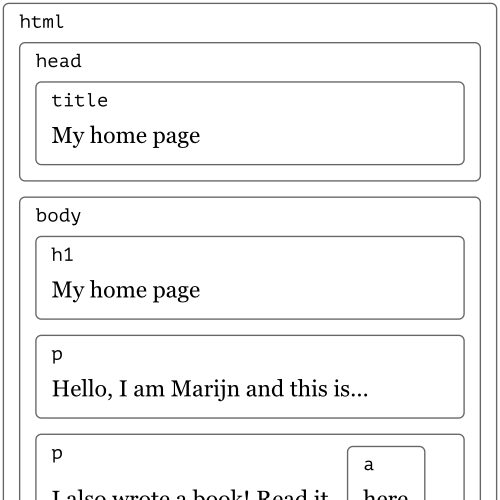
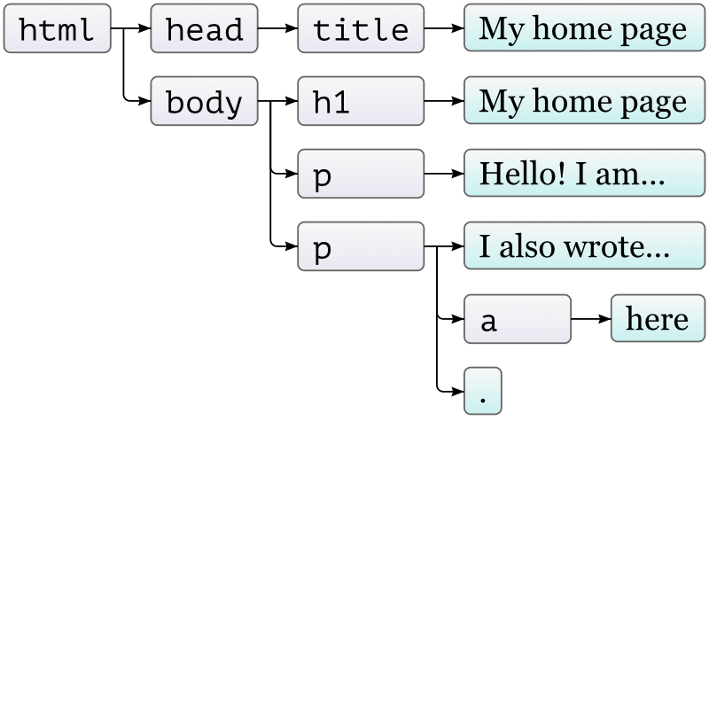
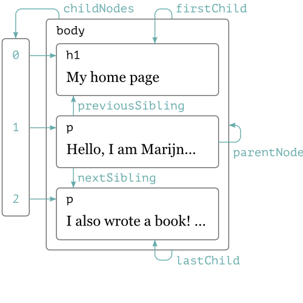

#HSLIDE
## DOM
### Document Object Model

#HSLIDE
#### disclaimer
part of these slides were based on several sources of information, namely:

* Eloquent JavaScript by Marijn Haverbeke
* MDN by Mozilla Contributors.


#HSLIDE
## The Document Object Model
* programming interface for HTML, XML, SVG
* document as a tree
* nodes and objects 


#HSLIDE
## sample HTML document
### html code
```html
<!doctype html>
<html>
  <head>
    <title>My home page</title>
  </head>
  <body>
    <h1>My home page</h1>
    <p>Hello, I am Marijn and this is my home page.</p>
    <p>I also wrote a book! Read it
      <a href="http://eloquentjavascript.net">here</a>.</p>
  </body>
</html>
```
#HSLIDE
## sample HTML document
#### layout structure


#HSLIDE
## sample HTML document
#### tree


#HSLIDE
## sample HTML document
#### dom navigation


#HSLIDE
#### locating elements

**Locating by id**

returns an ```Element```

```
// returns an element
var e = document.getElementById(id);
```

**Locating by Tag Name**

returns a **live** ```HTMLCollection```

```
var nl = document.getElementsByTagName(tagName);
var nl = <element>.getElementsByTagName(tagName);
```

**Locating by Class Name**

returns a **live** ```HTMLCollection```

```
var nl = document.getElementsByClassName(classNames);
var nl = <element>.getElementsByClassName(classNames);
```

#HSLIDE
#### selecting nodes

**selecting by query selector**

retuns the first Element that matches

```
var e = document.querySelector(cssQuery);
// also available at the Element interface
var e = <element>.querySelector(cssQuery);
```


retuns a **non-live** NodeList that matches

```
// returns a nl NodeList that matches
var nl = document.querySelectorAll(cssQuery);
// also available at the Element interface
var nl = <element>.querySelector(cssQuery);

```


#HSLIDE
#### creating nodes

```
var e = document.createElement(tagName[, options]);
var new = document.createTextNode(text); 
```

#HSLIDE
#### replacing nodes

```
var e = document.createElement(tagName[, options]);
var new = document.createTextNode(text); 
```

#HSLIDE
#### inserting nodes

The Node.appendChild() method adds a node to the end of the list of children of a specified parent node. If the node is already parented then it is reparented.

The Node.insertBefore() method inserts the specified node before the reference node as a child of the current node.

```
var n = element.appendChild(n); 
var insertedNode = parentNode.insertBefore(newNode, referenceNode);
```


